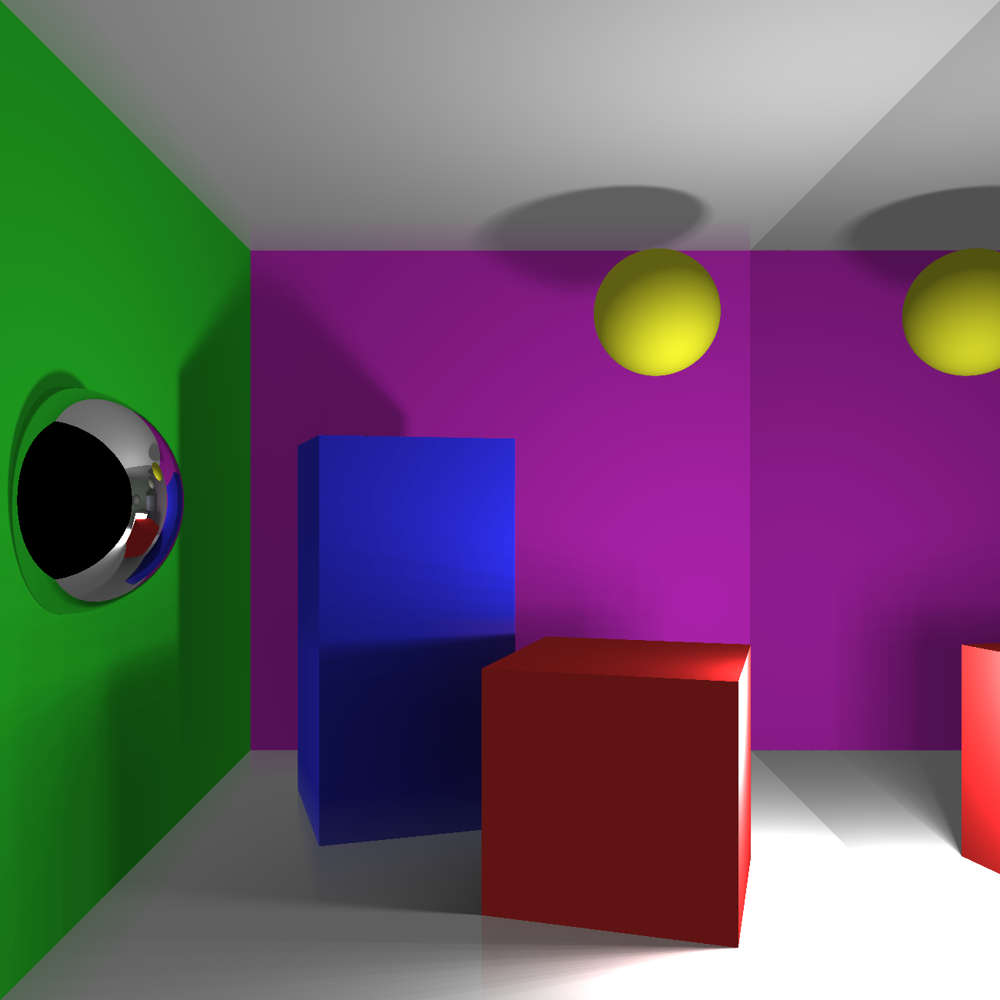

# C++ Raytracer

Simple raytracer modelling a Cornell Box written for COMS30115 coursework. Made using SDL for drawing pixels and GLM for mathematical objects and functions. Extensions include:
 - Cramer's rule (Improved runtime)
 - Supersampling Anti-Aliasing
 - Smooth Shadows
 - Darker / Deep Shadows
 - Mirror Material
 - Colour Bleeding (Kinda GI)
 - Spheres
 - OpenMP Optimisation
 - Runtime flags

### Run instructions
Ensure SDL and GLM are installed, and that the relative paths are correct in the makefile and `#include` headers. Build using `$ make`. Run using `$ ./Build/skeleton <flags>` where the available flags are listed below.
- `--soft4` to enable SSAA with a 4-sample grid
- `--soft8` to enable SSAA with a 8-sample grid
- `--smooth` to enable smooth shadows
- `--dark` to enable dark/deep shadows
- `--mirror` to enable mirror materials
- `--bleed` to enable colour bleeding (aspects of GI)
- `--all-flags` to enable all of the above, with SSAA set to 8-sample
